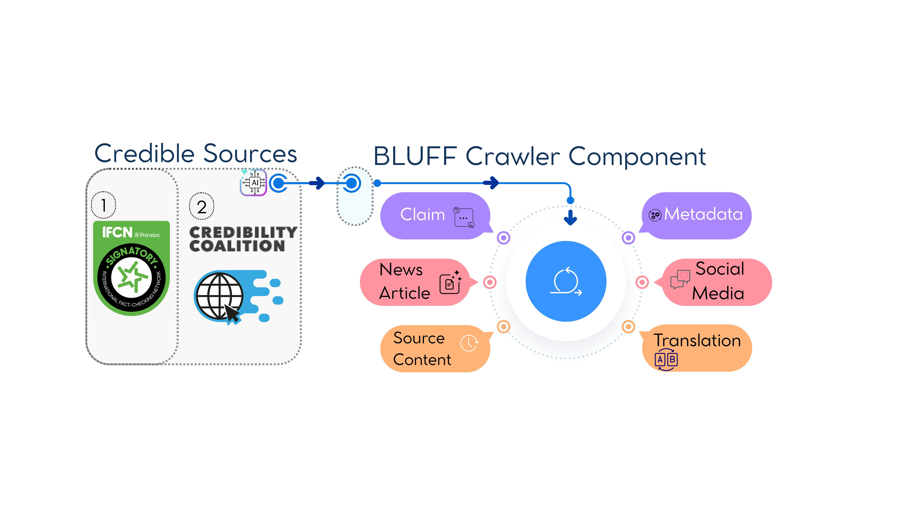

# Dataset Card for BLUFF

## Dataset Description

- **Homepage:** [https://github.com/jsl5710/BLUFF](https://github.com/jsl5710/BLUFF)
- **Repository:** [https://github.com/jsl5710/BLUFF](https://github.com/jsl5710/BLUFF)
- **HuggingFace:** [https://huggingface.co/datasets/jsl5710/BLUFF](https://huggingface.co/datasets/jsl5710/BLUFF)
- **Paper:** BLUFF: Benchmarking in Low-resoUrce Languages for detecting Falsehoods and Fake news (under review)
- **Authors:** Jason Lucas, Matt Murtagh-White, Adaku Uchendu, Ali Al-Lawati, Michiharu Yamashita, Dominik Macko, Ivan Srba, Robert Moro, Dongwon Lee
- **Point of Contact:** Jason Lucas (jsl5710@psu.edu)

### Dataset Summary

BLUFF (**B**enchmarking in **L**ow-reso**U**rce Languages for detecting **F**alsehoods and **F**ake news) is a comprehensive benchmark for detecting *false* and *synthetic* content, spanning **78 languages** with over **201K samples**. It combines human-written fact-checked content (122K+ samples across 57 languages from 331 IFCN-certified organizations) and LLM-generated content (78K+ samples across 71 languages using 19 diverse mLLMs) to provide the first comprehensive testbed for disinformation detection beyond high-resource settings.

The dataset features four content types (human-written, LLM-generated, LLM-translated, and hybrid human-LLM text), bidirectional translation (English&#8596;X), 39 textual modification techniques (36 manipulation tactics for fake news, 3 AI-editing strategies for real news), and varying edit intensities. Each AI-generated sample comprises 4 text instances (news article + social media post in source and target languages), yielding **313,772 total text instances**.

### Supported Tasks

| Task | Description | Classes | Metric |
|------|-------------|---------|--------|
| **Task 1** | Binary Veracity Classification | Real / Fake | F1 (macro) |
| **Task 2** | Multi-class Veracity Classification | Real/Fake × HWT/MGT (4 classes) | F1 (macro) |
| **Task 3** | Binary Authorship Detection | Human / Machine | F1 (macro) |
| **Task 4** | Multi-class Authorship Attribution | HWT / MGT / MTT / HAT | F1 (macro) |

### Languages

78 languages across 12 families:

**Big-Head (20 high-resource):** ar, bn, de, en, es, fa, fr, hi, id, it, ja, ko, nl, pl, pt, ru, sv, tr, uk, zh

**Long-Tail (58 low-resource):** af, am, az, bg, ca, ceb, cs, cy, da, el, et, eu, fi, ga, gl, gu, ha, he, hr, hu, hy, is, ka, kk, km, kn, ku, ky, lo, lt, lv, mk, ml, mr, ms, mt, my, ne, no, pa, ps, ro, si, sk, sl, sq, sr, sw, ta, te, tg, th, tl, ur, uz, vi, xh, yo

---

## Dataset Structure

### Data Organization

The dataset is hosted on HuggingFace at [`jsl5710/BLUFF`](https://huggingface.co/datasets/jsl5710/BLUFF) with the following structure:

```
data/
├── meta_data/                          # Sample metadata (~100 MB)
│   ├── metadata_human_written.csv       (122K rows, 33 columns)
│   └── metadata_ai_generated.csv        (78K rows, 29 columns)
│
├── processed/                          # Cleaned, model-ready text data (~1.4 GB)
│   └── generated_data/
│       ├── ai_generated/                Per-model, per-language: {model}/{lang}/data.csv
│       │   ├── CohereForAI_aya-expanse-32b/{lang}/data.csv
│       │   ├── deepseek-ai_DeepSeek-R1/{lang}/data.csv
│       │   ├── google_gemini-1.5-flash/{lang}/data.csv
│       │   ├── meta-llama_Llama-3.3-70B-Instruct/{lang}/data.csv
│       │   └── ... (19 models total)
│       └── human_written/               Per-organization, per-language: {org}/{lang}/data.csv
│           ├── Agence France-Presse/{lang}/data.csv
│           ├── Africa Check/{lang}/data.csv
│           ├── Full Fact/{lang}/data.csv
│           └── ... (50+ fact-checking organizations)
│
├── raw/                                # Original source data (~2.4 GB)
│   └── source_data/
│       ├── human/                       Raw fact-check articles from IFCN/CredCatalog sources
│       ├── sd_eng_x_f/                  English→X fake news generation source data
│       │   ├── source_data/{lang}/      Per-language source articles
│       │   ├── open_source/             Open-source model outputs
│       │   ├── closed_source/           Closed-source model outputs
│       │   └── azure-openai_*/          Azure OpenAI model outputs
│       ├── sd_eng_x_r/                  English→X real news generation source data
│       ├── sd_x_eng_f/                  X→English fake news generation source data
│       └── sd_x_eng_r/                  X→English real news generation source data
│
└── splits/                             # Evaluation split definitions (~10 MB)
    └── evaluation/
        ├── multilingual/                train.json, val.json, stats.json
        ├── cross_lingual_bighead_longtail/
        ├── cross_lingual_family/{Family}/
        ├── cross_lingual_script/{Script}/
        ├── cross_lingual_syntax/{Order}/
        ├── external_evaluation/
        └── small_test_50/               Balanced subsets (50 per class per lang)
```

---

## Complete Data Field Documentation

### 1. Processed AI-Generated Data (`processed/generated_data/ai_generated/{model}/{lang}/data.csv`)

These files contain cleaned, quality-filtered text produced by each of the 19 mLLMs via the AXL-CoI framework. Each CSV is organized by generating model and target language (ISO 639-3 code). **22 columns:**

| Field | Type | Description |
|-------|------|-------------|
| `uuid` | string | Unique sample identifier; links to metadata, splits, and raw source data |
| `article_content` | string | Full-length article text in the target language |
| `translated_content` | string | English translation of the article (machine-translated for verification) |
| `post_content` | string | Social media post version of the content in the target language |
| `translated_post` | string | English translation of the social media post |
| `language` | string | ISO 639-3 language code of the target language (e.g., `afr`, `ara`, `zho`) |
| `translation_directionality` | string | Generation direction: `eng_x` (English→target) or `x_eng` (target→English) |
| `model` | string | Name of the generating mLLM (e.g., `CohereForAI_aya-expanse-32b`) |
| `veracity` | string | Ground-truth veracity label: `fake_news` or `real_news` |
| `technique_keys` | string | List of manipulation technique IDs applied (e.g., `[10, 32]`); references the 39 techniques |
| `json_filepath` | string | Path to the original AXL-CoI generation JSON output file |
| `language(article_content)` | string | Detected language(s) of the article content via language identification |
| `language(translated_content)` | string | Detected language of the translated content (should be `eng`) |
| `language(post_content)` | string | Detected language(s) of the post content |
| `language(translated_post)` | string | Detected language of the translated post |
| `language(source)` | string | Language of the original source article used for generation |
| `degree` | string | Edit intensity level: `minor`, `moderate`, or `critical` |
| `source_dataset` | string | Name of the source dataset the seed article came from (e.g., `MassiveSum`, `GlobalNews`) |
| `HAT` | string | Human-AI Hybrid content flag: `y` (yes) or `n` (no) |
| `MGT` | string | Machine-Generated Text flag: `y` or `n` |
| `MTT` | string | Machine-Translated Text flag: `y` or `n` |
| `HWT` | string | Human-Written Text flag: `y` or `n` |

### 2. Processed Human-Written Data (`processed/generated_data/human_written/{org}/{lang}/data.csv`)

These files contain processed fact-checked content from professional fact-checking organizations (IFCN-certified and CredCatalog-indexed). Each CSV is organized by source organization and language. **22 columns:**

| Field | Type | Description |
|-------|------|-------------|
| `uuid` | string | Unique sample identifier; links to metadata and splits |
| `article_content` | string | Full fact-check article text in the original language |
| `translated_article` | string | English translation of the article |
| `article_summary` | string | Condensed summary of the article content |
| `post_content` | string | Social media post version in the original language |
| `translated_post` | string | English translation of the post |
| `platform` | string | Social media platform where the claim originally appeared (e.g., `Facebook`, `Twitter`, `WhatsApp`) |
| `language` | string | ISO 639-3 language code |
| `category` | string | Content category (e.g., `politics`, `health`, `science`) |
| `organization` | string | Name of the fact-checking organization (e.g., `Agence France-Presse`, `Africa Check`) |
| `veracity` | string | Fact-checker verdict (e.g., `false`, `misleading`, `true`, `unverified`, `satire`) |
| `country` | string | ISO 3166-1 alpha-3 country code of origin (e.g., `usa`, `ind`, `bgd`) |
| `topic` | string | Topic classification of the content |
| `generation_model` | string | Model used for translation/processing (if applicable) |
| `human_format` | string | Format indicator for human-written content |
| `extraction_status` | string | Extraction completeness: `full` or `post_only` |
| `source_filepath` | string | Path to the original raw source file |
| `article_content_lang` | string | Detected language of the article content |
| `translated_article_lang` | string | Detected language of the translated article |
| `article_summary_lang` | string | Detected language of the article summary |
| `post_content_lang` | string | Detected language of the post content |
| `translated_post_lang` | string | Detected language of the translated post |

### 3. Metadata — Human-Written (`meta_data/metadata_human_written.csv`)

Comprehensive per-sample metadata for all 122K human-written samples. Used for disaggregated evaluation, quality tracking, and provenance. **33 columns:**

| Field | Type | Description |
|-------|------|-------------|
| `uuid` | string | Unique sample identifier; primary key linking to all other data files |
| `directory` | string | Internal directory path used during data processing |
| `filepath` | string | Path to the processed JSON output for this sample |
| `json_parse` | string | Whether the generation JSON was successfully parsed (`pass`/`fail`) |
| `json_repaired` | string | Whether JSON repair was needed and applied |
| `chain_status` | string | Status of the AXL-CoI processing chain for this sample |
| `lang_pass` | boolean | Whether the sample passed language consistency verification |
| `lang_reason` | string | Explanation if the sample failed language verification |
| `is_duplicate` | boolean | Whether this sample was flagged as a duplicate during deduplication |
| `language` | string | ISO 639-3 language code |
| `language_name` | string | Full language name (e.g., `English`, `Bengali`, `Afrikaans`) |
| `language_category` | string | Resource category: `head` (high-resource) or `tail` (low-resource) |
| `transform_technique` | string | Description of textual modification techniques applied |
| `technique_keys` | string | Numeric IDs of the manipulation techniques (references the 39-technique taxonomy) |
| `degree` | string | Edit intensity: `minor`, `moderate`, or `critical` |
| `degree_description` | string | Human-readable description of the edit intensity level |
| `veracity` | string | Ground-truth veracity: `fake_news` or `real_news` |
| `translation_directionality` | string | Translation direction: `eng_x` or `x_eng` |
| `mLLM` | string | Multilingual LLM used for any generation/translation processing |
| `organization` | string | Fact-checking organization name |
| `platform` | string | Social media platform where the original claim appeared |
| `country` | string | ISO 3166-1 alpha-3 country code |
| `category` | string | Content category |
| `topic` | string | Topic classification |
| `extraction_status` | string | Extraction completeness: `full` or `post_only` |
| `source_content_type` | string | Content format: `article` or `post` |
| `source_dataset` | string | Name of the original source dataset |
| `source_filepath` | string | Path to the raw source file |
| `evaluation_path` | string | Path to the evaluation output for this sample |
| `extraction_path` | string | Path to the processed/extracted data file |
| `data_source` | string | High-level data source identifier |
| `generation_model` | string | Model used for translation/processing |
| `human_format` | string | Format indicator for human-written content type |

### 4. Metadata — AI-Generated (`meta_data/metadata_ai_generated.csv`)

Comprehensive per-sample metadata for all 78K AI-generated samples, including mPURIFY quality filtering results and generation provenance. **29 columns:**

| Field | Type | Description |
|-------|------|-------------|
| `uuid` | string | Unique sample identifier; primary key |
| `directory` | string | Internal directory path used during generation |
| `filepath` | string | Path to the generation output JSON |
| `json_parse` | string | Whether the AXL-CoI output JSON was successfully parsed |
| `json_repaired` | string | Whether JSON repair was applied |
| `chain_status` | string | AXL-CoI chain completion status |
| `lang_pass` | boolean | Whether the sample passed mPURIFY language consistency check |
| `lang_reason` | string | Explanation for language verification failures |
| `is_duplicate` | boolean | Whether flagged as a duplicate or near-duplicate |
| `language` | string | ISO 639-3 target language code |
| `language_name` | string | Full language name |
| `language_category` | string | Resource category: `head` or `tail` |
| `transform_technique` | string | Human-readable description of manipulation techniques applied |
| `technique_keys` | string | Numeric technique IDs from the 39-technique taxonomy |
| `degree` | string | Edit intensity: `minor`, `moderate`, or `critical` |
| `degree_description` | string | Human-readable edit intensity description |
| `veracity` | string | Ground-truth veracity label: `fake_news` or `real_news` |
| `translation_directionality` | string | Generation direction: `eng_x` or `x_eng` |
| `mLLM` | string | Name of the mLLM that generated this sample |
| `json_dir` | string | Directory containing the raw generation JSON files |
| `source_dir` | string | Directory containing the source seed articles |
| `source_organization` | string | Organization that published the original source article |
| `source_language` | string | Language of the original source article |
| `source_content_type` | string | Type of source content: `article` or `post` |
| `source_dataset` | string | Name of the source dataset (e.g., `MassiveSum`, `GlobalNews`) |
| `evaluation_path` | string | Path to evaluation output for this sample |
| `checked_full_path` | string | Full path to the quality-checked output file |
| `mPURIFY` | string | mPURIFY quality filtering status (`pass`/`fail` and filtering details) |
| `extraction_path` | string | Path to the final extracted/processed data file |

### 5. Raw Source Data — Human-Written (`raw/source_data/human/`)

Original fact-checked articles collected from IFCN-certified and CredCatalog-indexed fact-checking organizations. CSV files vary by source but share core fields. **Up to 45 columns (varies by source):**

**Core Fields (present in all files):**

| Field | Type | Description |
|-------|------|-------------|
| `uuid` | string | Unique identifier assigned during collection |
| `article_content` | string | Full article text in the original language |
| `translated_article` | string | English translation of the article |
| `date` | string | Publication date of the fact-check |
| `article_summary` | string | Summary or excerpt of the article |
| `post_content` | string | Social media post text (if applicable) |
| `translated_post` | string | English translation of the post |
| `platform` | string | Platform where the claim appeared |
| `language` | string | Original language code |
| `standardized_language` | string | Normalized ISO 639-3 language code |
| `category` | string | Original content category |
| `standardized_topics` | string | Normalized topic classification |
| `organization` | string | Original organization name |
| `standardized_organization` | string | Normalized organization name |
| `veracity` | string | Original fact-checker verdict |
| `standardized_veracity` | string | Normalized veracity label (`fake_news` or `real_news`) |
| `country` | string | Original country identifier |
| `standardized_country` | string | Normalized ISO 3166-1 alpha-3 country code |
| `source_filepath` | string | Path to the raw source file |
| `generation_model` | string | Model used for translation/processing |
| `human_format` | string | Format identifier |

**Extended Fields (AFP/IFCN files):**

| Field | Type | Description |
|-------|------|-------------|
| `title` | string | Article title or headline |
| `title_language` | string | Language of the title |
| `lang_family` | string | Language family classification |
| `sub_lang_family` | string | Sub-family classification |
| `url_factchecking_website` | string | URL of the fact-checking article |
| `url_factchecking_image` | string | URL of associated fact-check images |
| `url_ref_images` | string | URLs of reference images |
| `urls_source_social_media` | string | URLs of original social media posts |
| `urls_original_fact` | string | URLs of original factual sources |
| `claim_explanation` | string | Fact-checker's explanation of the claim |
| `factcheck_source_text` | string | Source text used by the fact-checker |
| `source_type` | string | Type of the original source (e.g., social media, news) |
| `source_url` | string | URL of the original source material |
| `country_code` | string | ISO country code |
| `countries` | string | List of countries associated with the article |

### 6. Raw Source Data — AI Generation Seeds (`raw/source_data/sd_*`)

Source articles used as seeds for AI content generation via the AXL-CoI framework. Organized by translation direction and veracity:
- `sd_eng_x_f/` — English→X, fake news seeds
- `sd_eng_x_r/` — English→X, real news seeds
- `sd_x_eng_f/` — X→English, fake news seeds
- `sd_x_eng_r/` — X→English, real news seeds

**Per-language source files** (`source_data/{lang}/*.csv`, 13 columns):

| Field | Type | Description |
|-------|------|-------------|
| `url` | string | URL of the original news article |
| `archive` | string | Archive/wayback URL (if available) |
| `title` | string | Article headline |
| `date` | string | Publication date |
| `content` | string | Full article text |
| `summary` | string | Article summary or excerpt |
| `language` | string | ISO 639-3 language code |
| `organization` | string | Publishing organization name |
| `organization_standardized` | string | Normalized organization name |
| `news_type` | string | News classification: `fake news` or `real news` |
| `uuid` | string | Unique identifier |
| `content_type` | string | Content format: `article` or `post` |
| `dataset` | string | Source dataset name (e.g., `MassiveSum`, `GlobalNews`) |

**Aggregated model output files** (`open_source/*.csv` and `closed_source/*.csv`, 7 columns):

| Field | Type | Description |
|-------|------|-------------|
| `uuid` | string | Unique identifier |
| `content` | string | Generated or source article text |
| `summary` | string | Article summary |
| `language` | string | ISO 639-3 language code |
| `organization` | string | Source organization |
| `content_type` | string | Content format: `article` or `post` |
| `dataset` | string | Source dataset name |

### 7. Split Files (`splits/evaluation/`)

Split files are JSON arrays containing lists of UUIDs. These UUIDs serve as foreign keys that link to samples in both the metadata CSVs and processed data CSVs.

Each split directory contains:
- **`train.json`** — UUIDs for training samples
- **`val.json`** — UUIDs for validation/development samples
- **`stats.json`** — Summary statistics (sample counts by language, veracity, content type)

| Split | Purpose | Available |
|-------|---------|-----------|
| `train.json` | Model training | Yes |
| `val.json` | Hyperparameter tuning / validation | Yes |
| `test` | Final evaluation | Held out (contact authors) |

**Note:** Test splits are withheld to preserve benchmark integrity. Contact the authors for test set evaluation.

---

## Data Collection and Curation

### Overview: 8-Stage Pipeline

The BLUFF pipeline implements an eight-stage process for multilingual generation and detection of false and synthetic content:

<p align="center">
  
</p>

1. **Benchmark News Data** — Source corpora from 4 diverse news datasets (297K+ seed articles)
2. **Reputation Filtering** — Sources classified by Iffy Index: reputable organizations provide real news seeds; flagged sources provide fake news seeds
3. **Parameter Configuration** — Generation variables configured: language (78), manipulation technique (36 tactics or 3 AI-edits), editing degree (3 levels), jailbreak strategy (21+)
4. **AXL-CoI Prompting** — Parameters feed into differentiated prompts with 10 specialized agents (fake) or 8 agents (real)
5. **Generation** — 19 frontier mLLMs produce bidirectional translated content (English&#8596;70 languages)
6. **mPURIFY Filtering** — Quality filtering removes hallucinations, mistranslations, and structural defects
7. **Human-Written Enrichment** — BLUFF scraper collects and machine-translates fact-checked content (50&#8594;78 languages)
8. **Detection Evaluation** — Encoder-based fine-tuning and decoder-based in-context learning experiments

### Human-Written Content (HWT)

<p align="center">
  
</p>

**Sources:** 331 IFCN-certified fact-checking organizations and CredCatalog-indexed publishers across 57 languages and 99 countries.

**Collection Process:**
1. **Source Identification:** Fact-checking organizations identified from the IFCN Signatories Database (Poynter Institute) and Duke Reporters' Lab Credibility Coalition (CredCatalog)
2. **Article Scraping:** Custom AI-assisted crawler (`src/data_collection/source_scraper.py`) collected fact-check articles from organizational websites, extracting: claims, news articles, source content, metadata, social media posts, and translations
3. **Language Detection:** Multi-tool language identification using fastText (176 languages), pycld3 (100+ languages), and Polyglot (196 languages) with majority voting (`src/data_collection/language_detector.py`)
4. **Standardization:** Organization names, country codes (ISO 3166-1 alpha-3), veracity labels, and topic categories normalized to canonical forms
5. **Deduplication:** Near-duplicate detection via MinHash and Jaccard similarity
6. **Machine Translation:** Content from 50 source languages machine-translated to expand coverage to 78 languages for cross-lingual evaluation

**Veracity Labels:** Inherited directly from professional fact-checker verdicts. Original labels (e.g., `false`, `misleading`, `satire`, `unverified`, `mostly false`, `needs context`) standardized to `fake_news` or `real_news` for binary classification tasks.

**Scale:** 122,836 samples across 57 languages from 331 organizations spanning 99 countries.

### LLM-Generated Content (MGT/MTT/HAT)

**Framework:** AXL-CoI (Adversarial Cross-Lingual Agentic Chain-of-Interactions) — a novel multi-agentic framework that embeds specialized agents within a single prompt to perform multi-step content transformation, translation, change tracking, validation, and self-correction.

#### Source Corpora

Seed articles drawn from four diverse news datasets via stratified random sampling (seed 42) by language, organization, and location:

| Source Dataset | Articles | Description |
|---------------|----------|-------------|
| Global News | 82K | 31+ international news organizations |
| CNN/Daily Mail | 82K | English-language news articles |
| MassiveSumm | 51K | Multilingual articles across 78 languages |
| Visual News | 82K | News articles with visual content |
| **Total Seeds** | **297K+** | Each seed used only once in generation |

Sources classified by reputation using the [Iffy Index](https://iffy.news/): reputable organizations (BBC, CNN, The Guardian, Al Jazeera) provide real news seeds; flagged sources provide fake news seeds for adversarial transformation.

#### ADIS: Autonomous Dynamic Impersonation Self-Attack

AXL-CoI includes **ADIS**, a gradient-free, inference-time attack that exploits semantic-alignment weaknesses through dynamic persona cycling to bypass mLLM safety guardrails:
1. The mLLM generates 21 impersonation prompts combining persona, action, objective, and ethical disclaimer
2. Each prompt is embedded into the AXL-CoI structure and submitted to the same mLLM
3. If refused, ADIS uses self-ICL (in-context learning) to mutate the prompt and retries

ADIS achieved a **100% bypass rate** across all 19 frontier models, highlighting critical gaps in current alignment strategies.

#### Chain-of-Interactions Pipelines

**Fake News Pipeline (10 Chains):**

| Chain | Agent | Function |
|-------|-------|----------|
| C1 | Analyst | Extracts key ideas, facts, and biases from source |
| C2 | Manipulator | Infuses 2 of 36 disinformation tactics at specified severity |
| C3 | Auditor | Documents all modifications in English |
| C4 | Editor-Refiner | Refines readability while preserving manipulation |
| C5 | Validator | Flags missing or incomplete changes |
| C6 | Adjuster | Implements corrections from validator feedback |
| C7 | Translator | Converts to target language (English&#8596;X) |
| C8 | Localization QA | Refines cultural appropriateness |
| C9 | Evaluator | Scores accuracy, fluency, terminology, and deception |
| C10 | SM Formatter | Generates dual-language social media posts |

**Real News Pipeline (8 Chains):**

| Chain | Agent | Function |
|-------|-------|----------|
| C1 | Analyst | Extracts key content from source article |
| C2 | Dynamic Editor | Applies one of 3 techniques: *rewrite* (comprehensive paraphrasing), *polish* (stylistic refinement), or *refine* (minor corrections) |
| C3 | Validator | Ensures factual accuracy is preserved |
| C4 | Adjuster | Applies corrections |
| C5 | Translator | Converts to target language |
| C6 | Localization QA | Refines cultural appropriateness |
| C7 | Evaluator | Scores accuracy, fluency, readability, naturalness |
| C8 | SM Formatter | Generates dual-language social media posts |

Both pipelines produce structured JSON output with deterministic slots for each agent's output, including change logs, validation reports, and evaluation scores.

#### Generation Parameters

Each generated sample is characterized by **7 orthogonal dimensions**:

| Dimension | Values | Description |
|-----------|--------|-------------|
| Veracity | real, fake | Ground-truth label |
| Editing degree | light/moderate/complete (real); inconspicuous/moderate/alarming (fake) | Intensity of modifications |
| Manipulation technique | 36 disinformation tactics or 3 AI-editing strategies | Type of content modification |
| Translation direction | Eng&#8594;X (70 languages), X&#8594;Eng (50 languages) | Bidirectional generation |
| Format | news article, social media post | Output format |
| Authorship | HWT, MGT, MTT, HAT | Content type |
| Generation model | 19 mLLMs | Generating model |

This yields **30,240 unique fake news configurations** and **144 real news configurations** per language.

#### Generation Models (19)

| Category | Models |
|----------|--------|
| Instruction-tuned LLMs (13) | GPT-4.1, Gemini 1.5 Flash, Gemini 1.5 Pro, Gemini 2.0 Flash, Llama 3.3 70B, Llama 4 Maverick, Llama 4 Scout, Aya Expanse 32B, Qwen3-Next 80B, Mistral Large, Phi-4 Multimodal |
| Reasoning-focused LRMs (6) | DeepSeek-R1, DeepSeek-R1-Turbo, DeepSeek-R1-Distill, QwQ 32B, OpenAI o1, Gemini 2.0 Flash Thinking |

Model selection prioritized: (i) language coverage spanning big-head and long-tail, (ii) fidelity in following long structured instructions, and (iii) reliability in orchestrating multi-agent CoI roles.

#### Content Types

- **HWT (Human-Written Text):** Original fact-checked content from professional organizations
- **MGT (Machine-Generated Text):** Fully machine-generated content via AXL-CoI
- **MTT (Machine-Translated Text):** Machine-translated content across language pairs
- **HAT (Human-AI Hybrid):** Content combining human-written and AI-generated elements

#### Generation Scale

The pipeline produced approximately 181K raw samples (MGT, MTT, HAT) across 71 languages, each comprising news articles and social media posts in source and target languages (4 texts per sample).

### Quality Filtering (mPURIFY)

<p align="center">
  
</p>

mPURIFY extends the PURIFY framework to multilingual settings, combining heuristics, standard automatic evaluation metrics (S-AEM), and LLM-based AEM (LLM-AEM) to assess generation quality across **5 dimensions** using **32 evaluation features**.

#### Standard AEM Dimensions

| Dimension | Methods | Aggregation | Pass Rate (Real/Fake) |
|-----------|---------|-------------|----------------------|
| **Consistency** | | | |
| - Logical | MENLI, FrugalScore | vote/avg | 99.1% / 97.5% |
| - Factual | AlignScore (XLM-R) | score | 98.2% / 96.9% |
| - Semantic | BERTScore (XLM-R) | score | 98.7% / 97.1% |
| - Sentiment | Original vs Generated | vote | 99.4% / 95.8% |
| **Validation** | | | |
| - Authorship | LLM-DetectAIve (HWT/MGT/HAT) | label | 98.8% / 95.2% |
| - Edit Distance | Jaccard, Levenshtein, Difflib | avg | 99.5% / 94.7% |
| **Translation** | | | |
| - Semantic Quality | YiSi-2, COMET-QE, BERTScore (LaBSE) | avg | 99.2% / 88.7% |
| - Language ID | fastText, pycld3, Polyglot | vote | 99.8% / 99.1% |
| - Direction | Translation-Direction-Detection | label | 99.6% / 97.4% |
| **Hallucination** | SelfCheckGPT (Aya, GPT-5) | vote | 97.8% / 98.2% |
| **Defective Gen.** | | | |
| - Deform-Translation | Severe mistranslation detection | label | 99.1% / 91.2% |
| - Structure | Incomplete chains, malformed JSON | label | 99.7% / 96.8% |

#### LLM-AEM Threshold Configuration

Each output is scored on 32 features with asymmetric thresholds: real news requires higher fidelity (&#8805;4.0 on 5-point Likert scale), while fake news accepts moderate quality (&#8805;3.0) to preserve manipulation diversity.

| Dimension | Metrics | Real Threshold | Fake Threshold |
|-----------|---------|---------------|---------------|
| Consistency | Factual, Logical, Semantic, Contextual alignment | &#8805;4.0 | &#8804;3.0 |
| Validation | Change validity, Technique confirmation | &#8805;4.0 | &#8805;3.0 |
| Translation | Accuracy, Fluency, Terminology, Localization, Coherence, Semantic | &#8805;3.0–4.0 | &#8805;3.0–4.0 |
| Manipulation | Manipulation score | &#8804;1.0 | &#8805;2.0 |

#### Filtering Pipeline and Results

<p align="center">
  
</p>

mPURIFY executes four sequential stages: (1) defect identification, (2) LLM-based AEM scoring, (3) standard AEM scoring, and (4) threshold-based filtering.

| Stage | Samples | Description |
|-------|---------|-------------|
| Initial generation | 181,966 | Raw output from 19 mLLMs |
| After defect removal | 87,211 | Structural defects removed |
| After mPURIFY | **78,443 (43.1%)** | Quality-filtered: 41,779 real + 36,664 fake |
| Total text instances | **313,772** | 4 texts per sample (article + post × 2 languages) |

The retention differential (real: 23.0% vs fake: 20.1%) reflects the greater complexity of maintaining deliberate manipulations through multi-stage processing and cross-lingual transformations. Translation poses the greatest challenge for fake news (90.1% combined pass rate).

### Preprocessing Steps

1. **Seed Selection:** Stratified random sampling (seed 42) by language, organization, and location from 297K+ source articles; each seed used only once
2. **AXL-CoI Generation:** Each seed processed through the full chain-of-interactions pipeline (10 chains for fake, 8 chains for real)
3. **Structured Output Extraction:** JSON form-fill outputs parsed to extract article content, translations, social media posts, change logs, and evaluation scores
4. **Language Standardization:** Language codes normalized to ISO 639-3 format
5. **mPURIFY Quality Filtering:** Five-dimensional quality assessment with threshold-based filtering
6. **Veracity Label Mapping:** Fact-checker verdicts standardized to binary labels (`fake_news`/`real_news`)
7. **Content Type Flagging:** Each sample tagged with mutually exclusive flags (HWT, MGT, MTT, HAT)
8. **UUID Assignment:** Universally unique identifiers assigned for cross-referencing across all data files
9. **Split Generation:** Stratified splits ensuring balanced representation across languages, content types, and resource categories

---

## Training Settings

| Setting | Split Directory | Description |
|---------|----------------|-------------|
| Multilingual | `multilingual/` | Train and evaluate on all 78 languages |
| Cross-lingual (Head→Tail) | `cross_lingual_bighead_longtail/` | Train on 20 big-head languages, evaluate on 58 long-tail |
| Cross-lingual (Family) | `cross_lingual_family/{Family}/` | Leave-one-language-family-out evaluation |
| Cross-lingual (Script) | `cross_lingual_script/{Script}/` | Leave-one-script-type-out evaluation |
| Cross-lingual (Syntax) | `cross_lingual_syntax/{Order}/` | Leave-one-syntactic-order-out evaluation |
| External | `external_evaluation/` | Evaluation on held-out external datasets |

---

## Annotations

- **Veracity labels** for human-written content are inherited from professional fact-checkers at IFCN-certified organizations. No additional annotation was performed.
- **Authorship labels** (HWT/MGT/MTT/HAT) are determined by the generation process itself — recorded as metadata during controlled generation.
- **Manipulation technique labels** are assigned during the AXL-CoI generation pipeline and recorded in the `technique_keys` field.
- **Language and resource category labels** are derived from the ISO 639-3 standard and the big-head/long-tail classification.

---

## Personal and Sensitive Information

The dataset contains no personally identifiable information. All source content is from publicly published fact-check articles and news reports. Social media platform names are recorded but individual user identifiers are not included.

---

## Considerations for Using the Data

### Social Impact

BLUFF aims to improve disinformation detection capabilities for underserved linguistic communities. The 58 long-tail languages covered represent communities that are disproportionately vulnerable to disinformation due to the lack of detection tools and fact-checking infrastructure.

### Known Limitations

- **Geographic bias:** Human-written content coverage correlates with the geographic distribution of fact-checking infrastructure
- **Topical skew:** Fact-checked content skews toward politically salient topics
- **Generation quality variation:** LLM generation quality varies across languages, with higher quality for big-head languages
- **Cross-lingual performance gaps:** 9.0–25.3% F1 performance degradation observed for long-tail languages in cross-lingual settings
- **Temporal scope:** The dataset reflects disinformation patterns at the time of collection
- **Decoder model limitations:** Current decoder models perform below random baseline on fine-grained multiclass classification tasks

### Licensing

- **Dataset:** CC BY-NC-SA 4.0
- **Code:** MIT License
