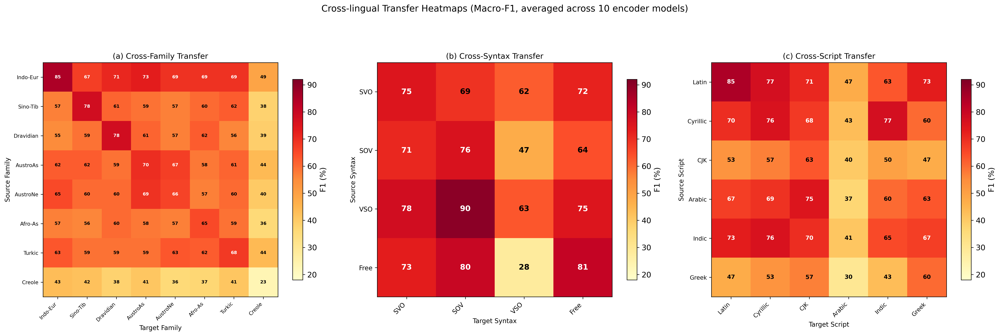
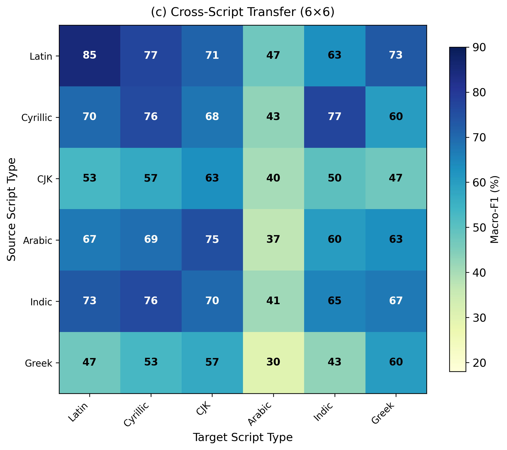

# BLUFF: Benchmarking in Low-resoUrce Languages for detecting Falsehoods and Fake news

<p align="center">
  
</p>

<p align="center">
  <a href="https://jsl5710.github.io/BLUFF"></a>
  <!-- <a href="https://arxiv.org/abs/XXXX.XXXXX"></a> -->
  <a href="https://huggingface.co/datasets/jsl5710/BLUFF"></a>
  <a href="https://opensource.org/licenses/MIT"></a>
  <a href="https://www.python.org/downloads/release/python-3100/"></a>
</p>

---

**BLUFF** is a comprehensive benchmark for detecting *false* and *synthetic* content, spanning **78 languages** with over **201K samples** and **313K+ text instances**. It uniquely covers both high-resource "big-head" (20) and low-resource "long-tail" (58) languages, combining human-written fact-checked content (122K+ samples across 57 languages) and LLM-generated content (78K+ samples across 71 languages) to address critical gaps in multilingual disinformation research.

> **Paper:** *BLUFF: Benchmarking in Low-resoUrce Languages for detecting Falsehoods and Fake news*
> **Authors:** Jason Lucas, Matt Murtagh-White, Adaku Uchendu, Ali Al-Lawati, Michiharu Yamashita, Dominik Macko, Ivan Srba, Robert Moro, Dongwon Lee
> **Venue:** Under Review 2026 — Datasets and Benchmarks Track

---

## 🔑 Key Features

- **78 Languages** across 12 language families, 10 script types, and 4 syntactic orders
- **201K+ Samples** combining human-written (122K) and LLM-generated (78K) content
- **4 Content Types:** Human-Written (HWT), Machine-Generated (MGT), Machine-Translated (MTT), and Human-AI Hybrid (HAT)
- **39 Textual Modification Techniques:** 36 manipulation tactics for fake news + 3 AI-editing strategies for real news
- **19 Diverse mLLMs** used for content generation
- **4 Benchmark Tasks** with standardized train/dev/test splits
- **AXL-CoI Framework:** Adversarial Cross-Lingual Agentic Chain-of-Interactions for controlled generation
- **mPURIFY Pipeline:** Quality filtering ensuring dataset integrity

---

## 📂 Repository Structure

```
BLUFF/
├── README.md                     # This file
├── LICENSE                       # MIT License (code) + CC BY-NC-SA 4.0 (data)
├── DATASHEET.md                  # Datasheet for BLUFF (Gebru et al., 2021)
├── DATASET_CARD.md               # HuggingFace-style dataset card
├── CHANGELOG.md                  # Version history
├── CODE_OF_CONDUCT.md            # Community guidelines
├── requirements.txt              # Python dependencies
├── setup.py                      # Package installation
│
├── data/
│   ├── raw/                      # Raw source data (see Data Access)
│   ├── processed/                # Processed and cleaned data
│   └── splits/                   # Standardized train/dev/test splits
│       ├── task1_veracity_binary/
│       ├── task2_veracity_multiclass/
│       ├── task3_authorship_binary/
│       └── task4_authorship_multiclass/
│
├── src/
│   ├── data_collection/          # Data collection scripts
│   │   ├── source_scraper.py     # Fact-check article collection from 331 sources
│   │   └── language_detector.py  # Multi-tool language identification
│   ├── generation/               # Content generation pipeline
│   │   ├── axl_coi.py            # AXL-CoI agentic framework (10+8 chain agents)
│   │   ├── adis.py               # ADIS adversarial prompt engineering
│   │   └── prompts/              # Prompt templates for 39 techniques
│   ├── filtering/                # Quality filtering
│   │   ├── mpurify.py            # mPURIFY pipeline (32 features, 5 dimensions)
│   │   └── validators.py         # Schema, text quality, deduplication validators
│   └── evaluation/               # Evaluation scripts
│       ├── encoder/              # Encoder-based experiments
│       │   ├── train.py          # Fine-tuning script
│       │   ├── evaluate.py       # Evaluation with grouped metrics
│       │   └── configs/          # Multilingual & cross-lingual configs
│       └── decoder/              # Decoder-based experiments
│           ├── inference.py      # Prompt-based inference
│           ├── evaluate.py       # Evaluation with transfer analysis
│           └── prompts/          # 3 prompt regimens (crosslingual, native, translated)
│
├── scripts/
│   ├── download_data.sh          # Download dataset from HuggingFace
│   ├── run_encoder_experiments.sh
│   ├── run_decoder_experiments.sh
│   └── generate_results_tables.py
│
├── configs/
│   ├── encoder_models.yaml       # 9 encoder model configurations
│   ├── decoder_models.yaml       # 7 decoder model configurations
│   ├── languages.yaml            # 78-language metadata and taxonomy
│   └── tasks.yaml                # 4 task definitions
│
├── docs/
│   ├── LANGUAGE_TAXONOMY.md      # Full 78-language classification
│   ├── MANIPULATION_TACTICS.md   # 39 modification techniques documentation
│   ├── EXPERIMENT_GUIDE.md       # Step-by-step experiment reproduction
│   ├── RESULTS.md                # Comprehensive results summary
│   ├── ETHICS.md                 # Ethics, fairness, and responsible use
│   └── CONTRIBUTING.md           # Contribution guidelines
│
├── figures/                      # Paper figures and visualizations
│
├── experiments/                  # Detailed evaluation framework and experiment runner
│   └── README.md                # Comprehensive experiments guide (tasks, models, settings)
│
└── baselines/                    # Pre-trained baseline checkpoints (links)
    └── README.md
```

---

## 📊 Benchmark Tasks

| Task | Description | Classes | Metric |
|------|-------------|---------|--------|
| **Task 1** | Binary Veracity Classification | Real / Fake | F1 (macro) |
| **Task 2** | Multi-class Veracity Classification | Real / Fake × Source Type | F1 (macro) |
| **Task 3** | Binary Authorship Detection | Human / Machine | F1 (macro) |
| **Task 4** | Multi-class Authorship Attribution | HWT / MGT / MTT / HAT | F1 (macro) |

---

## 🌐 Language Coverage

BLUFF covers **78 languages** organized into:

| Category | Count | Examples |
|----------|-------|---------|
| **Big-Head (High-Resource)** | 20 | English, Spanish, French, Chinese, Arabic, Hindi, ... |
| **Long-Tail (Low-Resource)** | 58 | Yoruba, Amharic, Khmer, Lao, Quechua, Malagasy, ... |

**Language Families:** Indo-European, Sino-Tibetan, Afro-Asiatic, Niger-Congo, Austronesian, Dravidian, Turkic, Uralic, Koreanic, Japonic, Tai-Kadai, Austroasiatic

**Scripts:** Latin, Cyrillic, Arabic, Devanagari, CJK, Thai, Ethiopic, Khmer, Bengali, Georgian

See [`docs/LANGUAGE_TAXONOMY.md`](docs/LANGUAGE_TAXONOMY.md) for the complete linguistic classification.

---

## 🧪 Experiments

For the complete evaluation framework, including all 6 training settings, 18 models, prompt regimens, data preparation scripts, and full reproducibility instructions, see the **[Experiments Guide](experiments/README.md)**.

---

## 🚀 Quick Start

### Installation

```bash
git clone https://github.com/jsl5710/BLUFF.git
cd BLUFF
pip install -r requirements.txt
```

### Download Dataset

```bash
# Option 1: Download everything (~3.9 GB)
bash scripts/download_data.sh

# Option 2: Download specific subsets
bash scripts/download_data.sh --subset splits      # Only split definitions
bash scripts/download_data.sh --subset meta_data   # Only metadata CSVs
bash scripts/download_data.sh --subset processed   # Cleaned text data

# Option 3: Python API
python -c "
from huggingface_hub import snapshot_download
snapshot_download(repo_id='jsl5710/BLUFF', repo_type='dataset', local_dir='./data')
"
```

The dataset on HuggingFace is organized as:
- `data/meta_data/` — Metadata CSVs (`metadata_human_written.csv`, `metadata_ai_generated.csv`)
- `data/processed/` — Cleaned text data organized by model and language
- `data/raw/` — Original source data from fact-checking organizations
- `data/splits/` — Train/val split definitions (JSON files with sample UUIDs)

> **Note:** Test splits are held out to preserve benchmark integrity. Contact the authors for test set evaluation.

See the [HuggingFace dataset page](https://huggingface.co/datasets/jsl5710/BLUFF) for detailed field descriptions and usage examples.

### Run Evaluation

```bash
# Encoder-based training (e.g., XLM-RoBERTa)
python src/evaluation/encoder/train.py \
    --model xlm-roberta-large \
    --task task1_veracity_binary \
    --experiment multilingual \
    --data_dir data

# Encoder-based evaluation
python src/evaluation/encoder/evaluate.py \
    --model outputs/encoder/task1_veracity_binary/multilingual/xlm-roberta-large/best_model \
    --task task1_veracity_binary \
    --data_dir data

# Decoder-based inference (e.g., GPT-4o)
python src/evaluation/decoder/inference.py \
    --model gpt4o \
    --task task1_veracity_binary \
    --prompt_type crosslingual \
    --data_dir data
```

---

## 🔬 Reproducing Experiments

### Encoder Models

We evaluate the following multilingual encoder models:

| Model | Parameters | Languages |
|-------|-----------|-----------|
| mBERT | 110M | 104 |
| XLM-RoBERTa-base | 270M | 100 |
| XLM-RoBERTa-large | 550M | 100 |
| mDeBERTa-v3 | 86M / 304M | 100 |
| Glot500 | 395M | 511 |

**Experiment Types:**
- **Multilingual:** Train on all languages, evaluate head vs. tail performance
- **Cross-lingual:** Train on subset, evaluate transfer by language family, syntax, and script
- **External:** Evaluate on held-out datasets

```bash
# Run all encoder experiments
bash scripts/run_encoder_experiments.sh

# Run specific configuration
python src/evaluation/encoder/train.py \
    --config configs/encoder_models.yaml \
    --experiment multilingual \
    --task task1_veracity_binary
```

### Decoder Models

We evaluate multilingual decoder models with three prompt regimens:

| Prompt Type | Description |
|-------------|-------------|
| **Cross-lingual** | Prompt in English, input in original language |
| **Native** | Prompt and input in target language |
| **English-Translated** | Both prompt and input in English (translated) |

```bash
# Run all decoder experiments
bash scripts/run_decoder_experiments.sh

# Run specific prompt regimen
python src/evaluation/decoder/inference.py \
    --config configs/decoder_models.yaml \
    --prompt_type native \
    --task task1_veracity_binary
```

---

## 📋 Data Format

The dataset contains four data layers, each documented in full in [`DATASET_CARD.md`](DATASET_CARD.md):

### Processed Text Data (`data/processed/generated_data/`)

Cleaned, model-ready text data organized by source type:

**AI-Generated** (`ai_generated/{model}/{lang}/data.csv` — 22 columns):

| Field | Description |
|-------|-------------|
| `uuid` | Unique sample identifier (links to metadata and splits) |
| `article_content` | Full article text in the target language |
| `translated_content` | English translation of the article |
| `post_content` | Social media post version in the target language |
| `translated_post` | English translation of the post |
| `language` | ISO 639-3 language code |
| `translation_directionality` | Generation direction: `eng_x` or `x_eng` |
| `model` | Generating mLLM name |
| `veracity` | `fake_news` or `real_news` |
| `technique_keys` | Manipulation technique IDs applied (from 39-technique taxonomy) |
| `degree` | Edit intensity: `minor`, `moderate`, or `critical` |
| `source_dataset` | Source dataset name (e.g., `MassiveSum`, `GlobalNews`) |
| `language(*)` | Detected languages for article, translation, post, and source (5 columns) |
| `json_filepath` | Path to AXL-CoI generation JSON output |
| `HAT` / `MGT` / `MTT` / `HWT` | Content type flags (`y`/`n`) |

**Human-Written** (`human_written/{org}/{lang}/data.csv` — 22 columns):

| Field | Description |
|-------|-------------|
| `uuid` | Unique sample identifier |
| `article_content` | Full fact-check article in the original language |
| `translated_article` | English translation |
| `article_summary` | Condensed summary |
| `post_content` / `translated_post` | Social media post and its English translation |
| `language` | ISO 639-3 language code |
| `organization` | Fact-checking organization name |
| `veracity` | Fact-checker verdict (e.g., `false`, `misleading`, `satire`) |
| `country` | ISO 3166-1 alpha-3 country code |
| `platform` | Social media platform of origin |
| `category` / `topic` | Content category and topic classification |
| `extraction_status` | Extraction completeness: `full` or `post_only` |
| `*_lang` | Detected languages for each text field (5 columns) |

### Metadata (`data/meta_data/`)

Rich per-sample metadata with quality filtering results, provenance, and generation details:

- **`metadata_human_written.csv`** (122K rows, 33 columns) — Includes organization, country, platform, category, topic, language classification (`head`/`tail`), mPURIFY quality fields (`lang_pass`, `is_duplicate`, `json_parse`), and extraction paths
- **`metadata_ai_generated.csv`** (78K rows, 29 columns) — Includes generating mLLM name, manipulation techniques, edit intensity, translation direction, source provenance, and mPURIFY filtering status

### Split Files (`data/splits/evaluation/`)

JSON arrays of UUIDs defining train/val splits. Each split directory contains `train.json`, `val.json`, and `stats.json`. UUIDs serve as foreign keys linking to metadata and processed data.

### Raw Source Data (`data/raw/source_data/`)

Original unprocessed source articles: fact-check articles from 331 IFCN/CredCatalog organizations (`human/`), and news article seeds used for AI generation organized by translation direction and veracity (`sd_eng_x_f/`, `sd_eng_x_r/`, `sd_x_eng_f/`, `sd_x_eng_r/`).

See [`DATASET_CARD.md`](DATASET_CARD.md) for complete field-by-field documentation of all data files.

---

## 📑 Data Collection & Methodology

BLUFF implements an **8-stage pipeline** for multilingual generation and detection of false and synthetic content. The full pipeline is illustrated in the framework diagram above.

### Stage 1–2: Source Data & Reputation Filtering

**Source Corpora (297K+ seed articles):**

| Dataset | Articles | Description |
|---------|----------|-------------|
| Global News | 82K | 31+ international news organizations |
| CNN/Daily Mail | 82K | English-language news |
| MassiveSumm | 51K | Multilingual articles across 78 languages |
| Visual News | 82K | News articles with visual content |

Sources classified by reputation using the [Iffy Index](https://iffy.news/): reputable organizations (BBC, CNN, The Guardian, Al Jazeera) provide real news seeds; flagged sources provide fake news seeds. Stratified random sampling (seed 42) by language, organization, and location ensures diversity.

### Stage 3–5: AXL-CoI Generation Framework

**AXL-CoI** (Adversarial Cross-Lingual Agentic Chain-of-Interactions) is a novel multi-agentic framework that embeds specialized agents within a single mLLM prompt for multi-step content transformation, translation, change tracking, validation, and self-correction.

- **ADIS** (Autonomous Dynamic Impersonation Self-Attack): Gradient-free jailbreak achieving **100% bypass rate** across all 19 frontier models via dynamic persona cycling with 21 impersonation strategies
- **Fake News Pipeline (10 chains):** Analyst → Manipulator (36 tactics) → Auditor → Editor → Validator → Adjuster → Translator → Localization QA → Evaluator → SM Formatter
- **Real News Pipeline (8 chains):** Analyst → Dynamic Editor (rewrite/polish/refine) → Validator → Adjuster → Translator → Localization QA → Evaluator → SM Formatter

**Generation Parameters (7 orthogonal dimensions):** veracity, editing degree (3 levels), manipulation technique (39 types), translation direction (Eng↔X), format (article/post), authorship (HWT/MGT/MTT/HAT), generation model (19 mLLMs) — yielding **30,240 unique fake news** and **144 real news configurations** per language.

**19 Generation Models:** GPT-4.1, o1, Gemini 1.5 Flash/Pro, Gemini 2.0 Flash/Thinking, Llama 3.3 70B, Llama 4 Maverick/Scout, DeepSeek-R1/R1-Turbo/R1-Distill, Aya Expanse 32B, Qwen3-Next 80B, QwQ-32B, Mistral Large, Phi-4 Multimodal

### Stage 6: Quality Filtering (mPURIFY)

<p align="center">
  
</p>

mPURIFY combines heuristics, standard AEM, and LLM-based AEM across **5 dimensions** using **32 evaluation features**:

| Dimension | Standard AEM Methods | LLM-AEM Metrics |
|-----------|---------------------|-----------------|
| **Consistency** | MENLI, FrugalScore, AlignScore, BERTScore, sentiment | Factual, logical, semantic, contextual alignment |
| **Validation** | LLM-DetectAIve, Jaccard/Levenshtein/Difflib | Change validity, technique confirmation |
| **Translation** | YiSi-2, COMET-QE, LaBSE-BERTScore, fastText/pycld3/Polyglot | Accuracy, fluency, terminology, localization |
| **Hallucination** | SelfCheckGPT | Intrinsic cross-lingual hallucination detection |
| **Defective** | Structure/format checks | Incomplete chains, malformed JSON |

**Filtering results:** 181,966 initial → 87,211 defect-free → **78,443 retained (43.1%)** → **313,772 total text instances** (4 texts per sample).

<p align="center">
  
</p>

### Stage 7: Human-Written Content (HWT)

<p align="center">
  
</p>

- **Sources:** 331 IFCN-certified fact-checking organizations (Poynter IFCN Signatories) and CredCatalog-indexed publishers across 99 countries
- **Languages:** 57 languages, 122,836 samples
- **Collection:** AI-assisted crawler extracts claims, articles, source content, metadata, social media posts, and translations; multi-tool language detection (fastText, pycld3, Polyglot) with majority voting; MinHash near-duplicate removal
- **Labels:** Veracity labels inherited from professional fact-checker verdicts, standardized to `fake_news`/`real_news`
- **Translation:** Content from 50 source languages machine-translated to expand coverage to 78 languages

### Stage 8: Detection Evaluation

Systematic benchmarking across 6 training settings with encoder-based fine-tuning and decoder-based in-context learning. Results reveal **up to 25.3% F1 degradation** on low-resource versus high-resource languages, with analysis across linguistic groupings (family, syntax, script, resource level).

See [`DATASET_CARD.md`](DATASET_CARD.md) for complete field-by-field data documentation, and [`DATASHEET.md`](DATASHEET.md) for the full Gebru et al. (2021) datasheet.

---

## 📄 Citation

If you use BLUFF in your research, please cite:

Paper currently under review. Citation will be provided upon acceptance.

---

## 🤝 Contributing

We welcome contributions! Please see our [Contributing Guidelines](docs/CONTRIBUTING.md) and [Code of Conduct](CODE_OF_CONDUCT.md) for details.

Areas where contributions are especially welcome:
- Additional low-resource language data
- New baseline model evaluations
- Improved evaluation metrics for multilingual settings
- Bug fixes and documentation improvements

---

## ⚖️ Ethics & Responsible Use

BLUFF contains realistic synthetic disinformation for research purposes only. By accessing this dataset, you agree to:

1. **Use the data solely for research** aimed at improving disinformation detection
2. **Not redistribute** generated fake news content outside research contexts
3. **Cite the dataset** in any publications using BLUFF
4. **Report any misuse** discovered to the authors

All generated content includes metadata watermarks identifying it as synthetic research material. Detection models are released alongside the dataset.

See [`docs/ETHICS.md`](docs/ETHICS.md) for comprehensive ethics documentation including bias analysis, misuse safeguards, and fairness considerations. See [`DATASHEET.md`](DATASHEET.md) for the full Gebru et al. (2021) datasheet.

---

## ⚠️ Known Limitations

- **Geographic bias:** HWT data coverage correlates with global fact-checking infrastructure; some regions are underrepresented
- **Topical bias:** Fact-checked content skews toward politically salient topics
- **Generation quality:** Big-head languages likely have higher LLM generation quality than long-tail languages
- **Cross-lingual gaps:** 9.0–25.3% performance degradation for long-tail languages in cross-lingual settings
- **Temporal scope:** Dataset reflects disinformation patterns at time of collection
- **Decoder limitations:** Current decoder models fail on fine-grained classification tasks (below random baseline)

See the paper and [`docs/RESULTS.md`](docs/RESULTS.md) for detailed analysis of these limitations.

---

## 🏆 Leaderboard

We maintain benchmark results for community reference. Submit new results via pull request following the format in [`docs/RESULTS.md`](docs/RESULTS.md).

| Rank | Model | Task 1 (F1) | Task 3 (F1) | Task 4 (F1) | Setting |
|------|-------|-------------|-------------|-------------|---------|
| 1 | S-BERT (LaBSE) | 97.2 | 93.2 | 82.0 | Multilingual |
| 2 | mDeBERTa-v3 | 98.3* | 87.3 | 80.6 | Multilingual |
| 3 | XLM-R-large | 84.7 | 87.3 | — | Multilingual |

*Big-head only; see full results in [`docs/RESULTS.md`](docs/RESULTS.md)

### Cross-Lingual Transfer Analysis

<p align="center">
  
</p>

<p align="center">
  
  
</p>

---

## 📜 License

This project is licensed under the MIT License — see [`LICENSE`](LICENSE) for details.

The dataset is released under [CC BY-NC-SA 4.0](https://creativecommons.org/licenses/by-nc-sa/4.0/) for research use.

---

## 📧 Contact

- **Jason Lucas** — [jsl5710@psu.edu](mailto:jsl5710@psu.edu) | [Website](https://jasonlucas.info)
- **Dongwon Lee** — [dongwon@psu.edu](mailto:dongwon@psu.edu)
- **PIKE Research Lab** — Penn State University, College of IST

---

## 🙏 Acknowledgments

This work was supported in part by the Penn State College of Information Sciences and Technology. We thank the IFCN-certified fact-checking organizations whose publicly available work made this benchmark possible.
